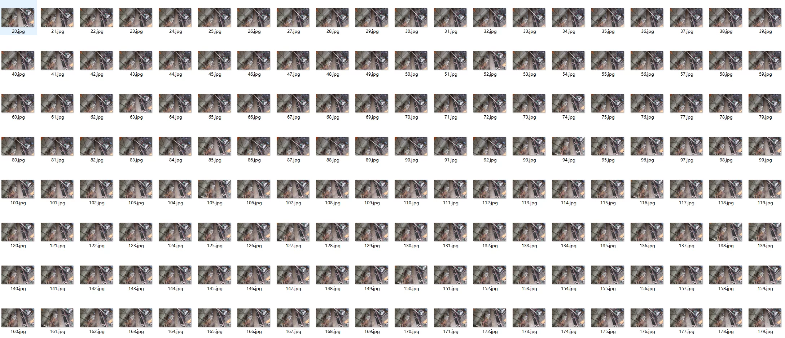
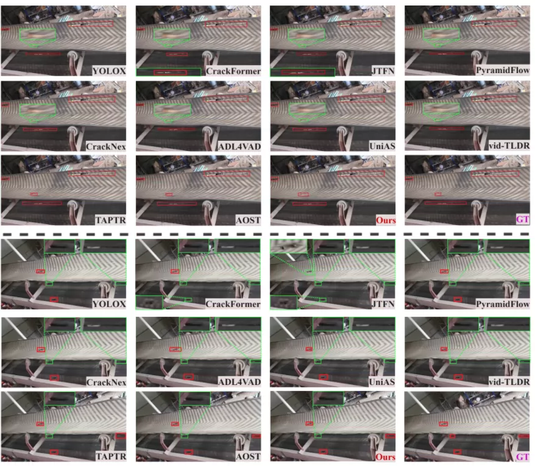
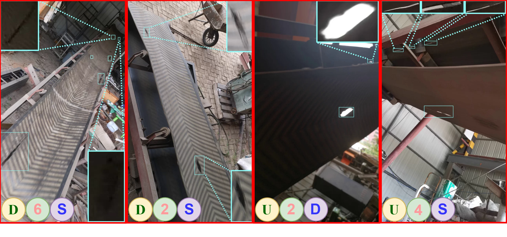
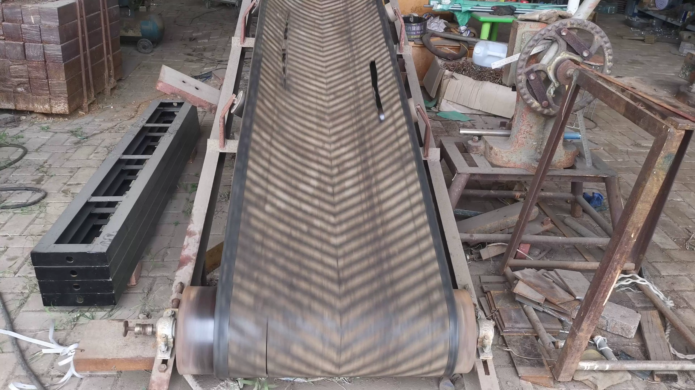
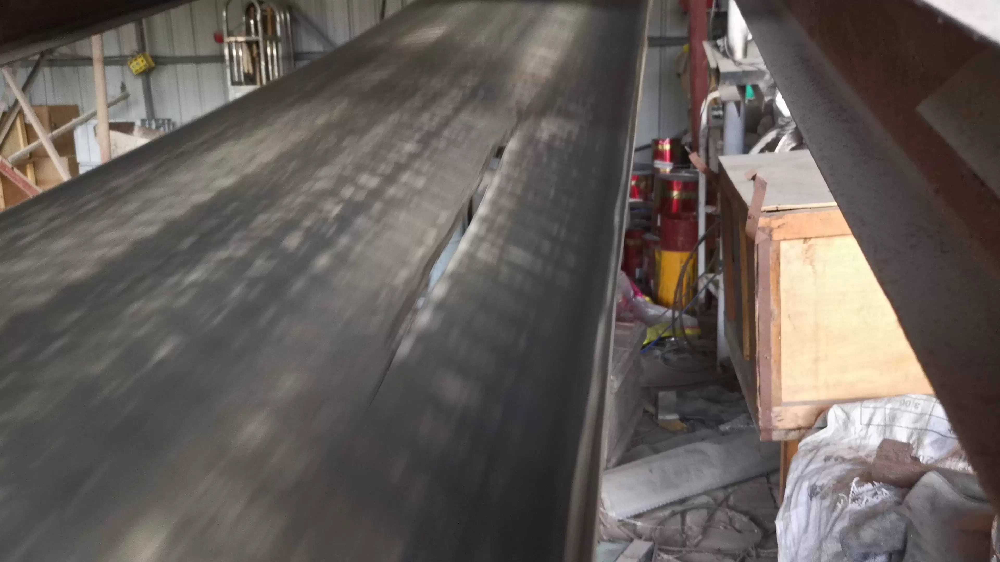
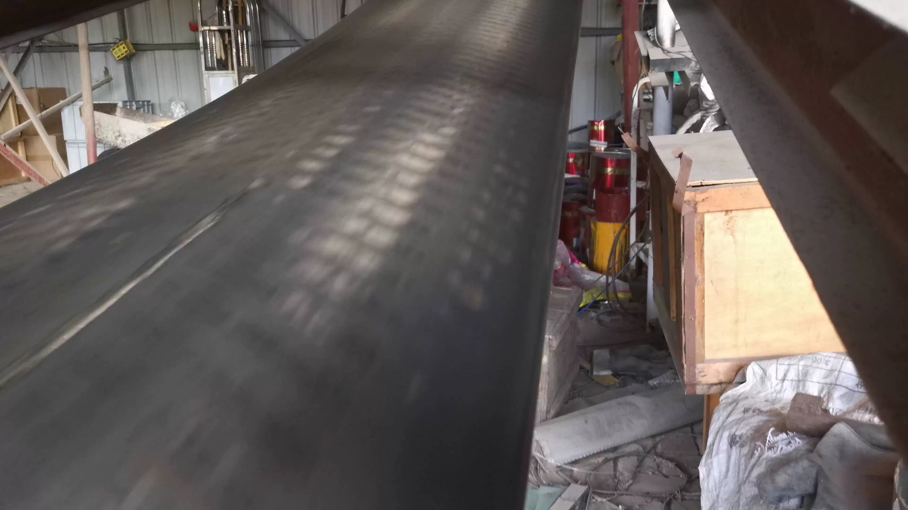

## Body

The industrial conveyor belt crack detection dataset in COCO format is collected in a real industrial environment using a portable smartphone mounted on a movable tripod to reduce motion blur. The camera runs at 30 frames per second with a resolution of 16:9 (3840×2160 and 1920×1080). The capture conditions are intentionally diverse to ensure their robustness:

• Multi-view views: top-down and bottom-up

• Time-varying lighting: from strong morning light to dim evening lighting

• Multiple weather scenarios: sunny, rainy, and snowy

• Dynamic belt speed: ranging from 2 to 6 meters/second

The initial three-channel RGB video stream is split into frame sequences, followed by frame-level bounding box annotations, and finally structured into a hierarchical format compatible with COCO specifications. The dataset currently focuses on a single cracking category and inherently supports future multi-category extensions.

BeltCrack14ks: contains 14,087 images from 29 sequences, divided into training, validation, and test sets with a ratio of 6:2:2 (8773 training, 2596 validation, 2718 test images). Each sequence has an average of 48576 images and 2.65 cracks, with strong crack significance and dense crack distribution. Cracks are categorized by pixel area into small cracks (<100), small cracks (100–1000), medium cracks (1000–10000), large cracks (10000–100000), and giant cracks (≥1000000), with a long-tailed normal area distribution.

BeltCrack9kd: contains 9645 images from 42 sequences, divided into training and test sets at a ratio of 8:2 (7697 training images, 1948 test images). Each sequence has an average of 22964 images and 134 cracks, characterized by weak crack significance, sparse and discrete crack distribution. It also follows the crack area classification, with higher crack dispersion, which brings greater challenges for sparse crack detection.

The dataset size is 38G

## Images

Here is a pay link on Stripe ( https://buy.stripe.com/3cs8yP7sY87d0vu9AB ). Please contact me lonlonago@foxmail.com after funding $89, and I will send you a complete data files , thank you!

